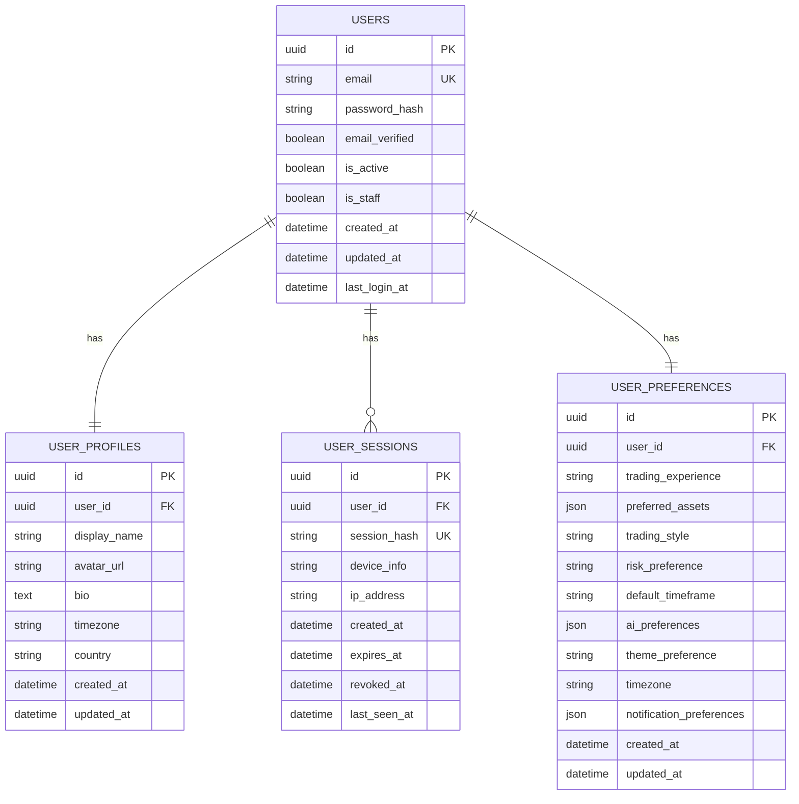
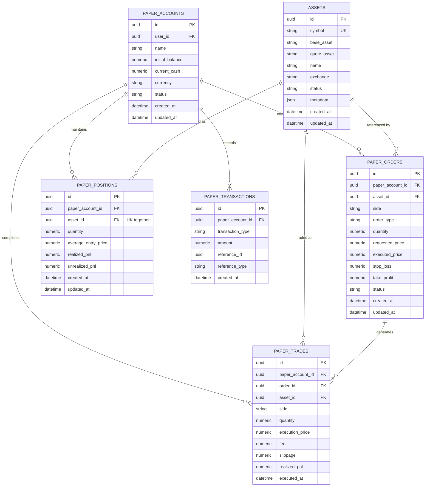
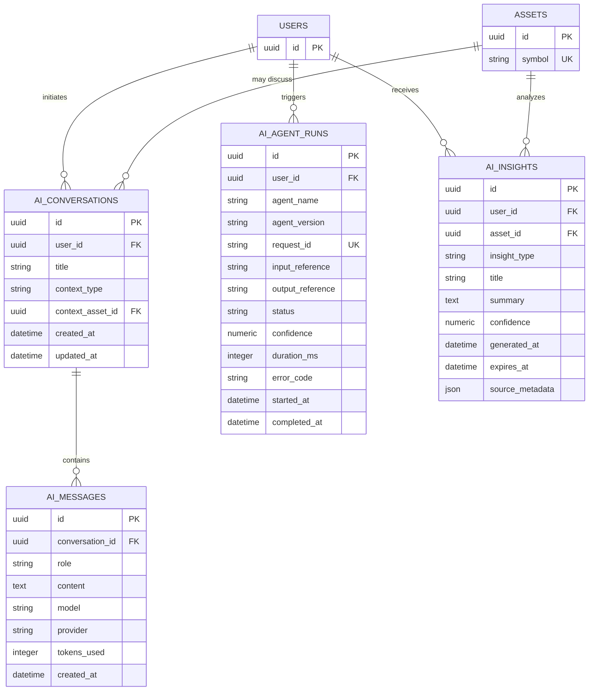
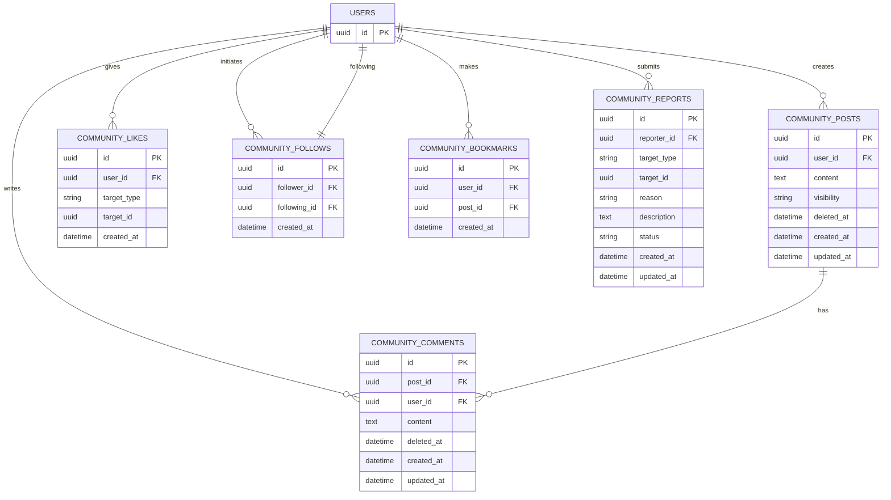
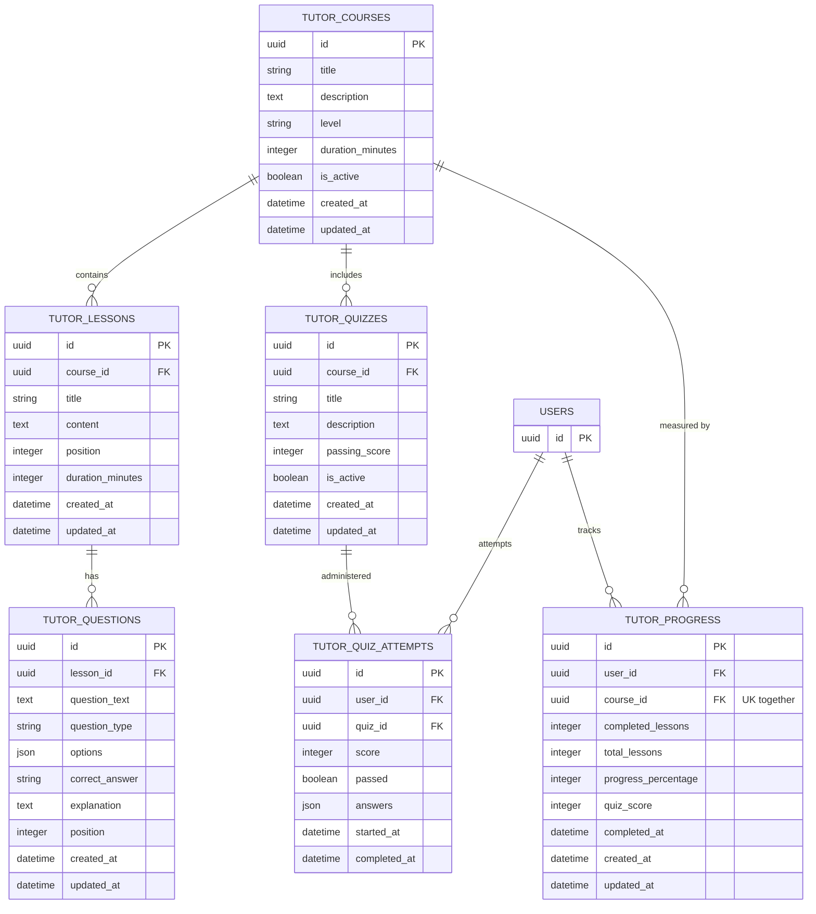
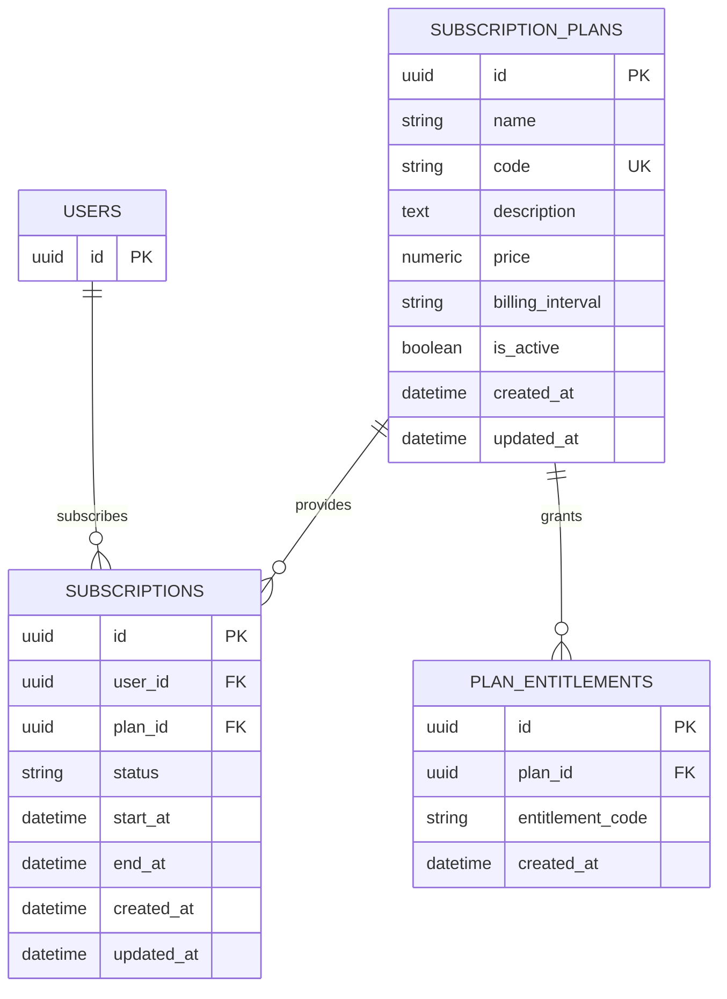

# Friday Database Entity-Relationship Diagram (ERD)

**Version**: v0.01 Phase 2  
**Format**: Mermaid ERD  
**Purpose**: Visual representation of all 16 business domains and their relationships

---

## Complete ERD (Mermaid)

```mermaid
erDiagram
    %% Domain 1: Users & Authentication
    USERS ||--o{ USER_PROFILES : has
    USERS ||--o{ USER_SESSIONS : has
    USERS ||--o{ USER_PREFERENCES : has
    
    %% Domain 2: Subscriptions
    USERS ||--o{ SUBSCRIPTIONS : subscribes
    SUBSCRIPTION_PLANS ||--o{ SUBSCRIPTIONS : provides
    SUBSCRIPTION_PLANS ||--o{ PLAN_ENTITLEMENTS : grants
    
    %% Domain 3: Assets & Watchlists
    USERS ||--o{ WATCHLISTS : creates
    WATCHLISTS ||--o{ WATCHLIST_ITEMS : contains
    ASSETS ||--o{ WATCHLIST_ITEMS : appears_in
    
    %% Domain 4: Paper Trading
    USERS ||--o{ PAPER_ACCOUNTS : owns
    PAPER_ACCOUNTS ||--o{ PAPER_ORDERS : executes
    PAPER_ACCOUNTS ||--o{ PAPER_POSITIONS : maintains
    PAPER_ACCOUNTS ||--o{ PAPER_TRADES : completes
    PAPER_ACCOUNTS ||--o{ PAPER_TRANSACTIONS : records
    ASSETS ||--o{ PAPER_ORDERS : referenced
    ASSETS ||--o{ PAPER_POSITIONS : held
    ASSETS ||--o{ PAPER_TRADES : traded
    PAPER_ORDERS ||--o{ PAPER_TRADES : generates
    
    %% Domain 5: Journal
    USERS ||--o{ TRADE_JOURNAL_ENTRIES : writes
    PAPER_TRADES ||--o{ TRADE_JOURNAL_ENTRIES : referenced
    
    %% Domain 6: Portfolio
    USERS ||--o{ PORTFOLIO_SNAPSHOTS : has
    PAPER_ACCOUNTS ||--o{ PORTFOLIO_SNAPSHOTS : tracked
    
    %% Domain 7: AI
    USERS ||--o{ AI_CONVERSATIONS : initiates
    ASSETS ||--o{ AI_CONVERSATIONS : discusses
    AI_CONVERSATIONS ||--o{ AI_MESSAGES : contains
    
    %% Domain 8: AI Agents
    USERS ||--o{ AI_AGENT_RUNS : triggers
    USERS ||--o{ AI_INSIGHTS : receives
    ASSETS ||--o{ AI_INSIGHTS : analyzes
    
    %% Domain 9: Alerts & Notifications
    USERS ||--o{ ALERT_RULES : defines
    ASSETS ||--o{ ALERT_RULES : monitors
    ALERT_RULES ||--o{ ALERT_EVENTS : triggers
    USERS ||--o{ NOTIFICATIONS : receives
    
    %% Domain 10: Community
    USERS ||--o{ COMMUNITY_POSTS : creates
    COMMUNITY_POSTS ||--o{ COMMUNITY_COMMENTS : has
    USERS ||--o{ COMMUNITY_COMMENTS : writes
    USERS ||--o{ COMMUNITY_LIKES : gives
    USERS ||--o{ COMMUNITY_FOLLOWS : initiates
    USERS ||--o{ COMMUNITY_BOOKMARKS : makes
    USERS ||--o{ COMMUNITY_REPORTS : submits
    
    %% Domain 11: Tutor
    TUTOR_COURSES ||--o{ TUTOR_LESSONS : contains
    TUTOR_LESSONS ||--o{ TUTOR_QUESTIONS : has
    TUTOR_COURSES ||--o{ TUTOR_QUIZZES : includes
    TUTOR_QUIZZES ||--o{ TUTOR_QUIZ_ATTEMPTS : administered
    USERS ||--o{ TUTOR_QUIZ_ATTEMPTS : attempts
    USERS ||--o{ TUTOR_PROGRESS : tracks
    TUTOR_COURSES ||--o{ TUTOR_PROGRESS : measured
    
    %% Domain 12: Audit
    USERS ||--o{ AUDIT_LOGS : generates
```



---

## Domain-Specific Diagrams

### Domain 1: Users & Authentication



### Domain 4: Paper Trading (Complex)



### Domain 7: AI & Agents



### Domain 10: Community (Social)



### Domain 11: Tutor (Learning)



### Domain 2: Subscriptions & Entitlements



---

## Key Relationships Summary

### One-to-One (1:1)
- User ↔ UserProfile
- User ↔ UserPreferences
- PaperPosition ↔ (Account, Asset) [Unique constraint]
- TutorProgress ↔ (User, Course) [Unique constraint]

### One-to-Many (1:N)
- User → UserSessions (multiple sessions per user)
- User → PaperAccounts (multiple accounts per user)
- User → AIConversations (multiple conversations per user)
- PaperAccount → PaperOrders (multiple orders per account)
- PaperAccount → PaperTrades (multiple trades per account)
- PaperAccount → PaperTransactions (immutable audit trail)
- SubscriptionPlan → Subscriptions (multiple subscriptions across users)
- SubscriptionPlan → PlanEntitlements (multiple entitlements per plan)
- TutorCourse → TutorLessons (course structure)
- TutorCourse → TutorQuizzes (assessments per course)
- CommunityPost → CommunityComments (comment threads)

### Many-to-Many (N:M) (via junction tables)
- User ↔ Asset (via WatchlistItem)
- User ↔ Post (via CommunityLike, CommunityBookmark)
- User ↔ User (via CommunityFollow - bidirectional)
- SubscriptionPlan ↔ Entitlements (via PlanEntitlements - but actually 1:N due to flexibility)

### Flexible References (polymorphic)
- Notification references any entity via (reference_type, reference_id)
- CommunityLike references any target via (target_type, target_id)
- CommunityReport references any target via (target_type, target_id)
- AlertEvent references any source via (reference_type, reference_id)
- AuditLog references any resource via (resource_type, resource_id)

---

## Data Flow Examples

### Example 1: User Signs Up

```
1. INSERT User
   ↓
2. INSERT UserProfile (1:1 cascade)
   ↓
3. INSERT UserPreferences (1:1 cascade)
   ↓
4. INSERT UserSession
   ↓
5. Auto-assign: Subscription (user_id → FREE plan_id)
   ↓
6. AuditLog: action='signup'
```

### Example 2: Execute Paper Trade

```
1. GET PaperAccount (verify user owns account)
   ↓
2. GET Asset (lookup traded asset)
   ↓
3. INSERT PaperOrder (create order)
   ↓
4. INSERT PaperTrade (execute trade, record immutably)
   ↓
5. UPDATE PaperAccount.current_cash (deduct execution cost)
   ↓
6. INSERT PaperTransaction (audit trail of cash movement)
   ↓
7. UPDATE/INSERT PaperPosition (update holdings)
   ↓
8. INSERT AuditLog (action='trade_execution')
   ↓
9. INSERT Notification (notify user of trade)
```

### Example 3: User Views Insights

```
1. GET AIInsight WHERE user_id=$1 AND expires_at > NOW()
   ↓
2. JOIN Asset ON insight.asset_id = asset.id (enrich with symbol)
   ↓
3. FILTER by AIInsight.confidence >= threshold
   ↓
4. ORDER BY generated_at DESC
   ↓
5. Render insights in frontend
```

---

## Uniqueness & Cardinality Legend

- **PK** = Primary Key (UUID)
- **FK** = Foreign Key (references another table)
- **UK** = Unique Constraint (values must be unique)
- **||** = One (exactly 1)
- **o{** = Zero or More (0..N)
- **|{** = One or More (1..N)

---

## Entity Count & Storage Estimation

| Domain | Table Count | Approx. Records (1M users) | Storage |
|--------|-------------|---------------------------|---------|
| Users & Auth | 4 | ~1M users + 5M sessions | ~500 MB |
| Subscriptions | 3 | ~1M subscriptions | ~100 MB |
| Assets & Watchlists | 3 | ~100 assets, 5M watchlist items | ~200 MB |
| Paper Trading | 5 | 10M orders, 5M positions, 50M trades, 100M transactions | ~5 GB |
| Journal & Portfolio | 2 | 10M entries, 100M snapshots | ~2 GB |
| AI | 4 | 5M conversations, 50M messages, 10M runs, 100M insights | ~3 GB |
| Alerts & Notifications | 3 | 50M alerts, 500M events, 500M notifications | ~2 GB |
| Community | 6 | 10M posts, 50M comments, 500M likes, 50M follows | ~2 GB |
| Tutor | 6 | 100 courses, 1K lessons, 100K questions, 10M attempts | ~500 MB |
| Audit | 1 | 1B logs (1 year retention) | ~10 GB |
| **TOTAL** | **37** | **~1.2B records** | **~25 GB** |

---

**ERD Documentation End**  
For updates, see DATABASE_DESIGN.md
